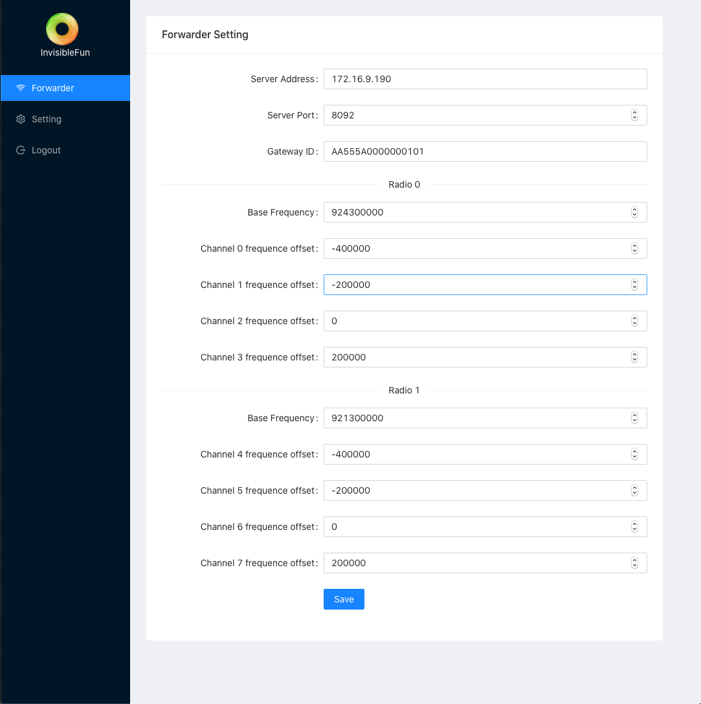
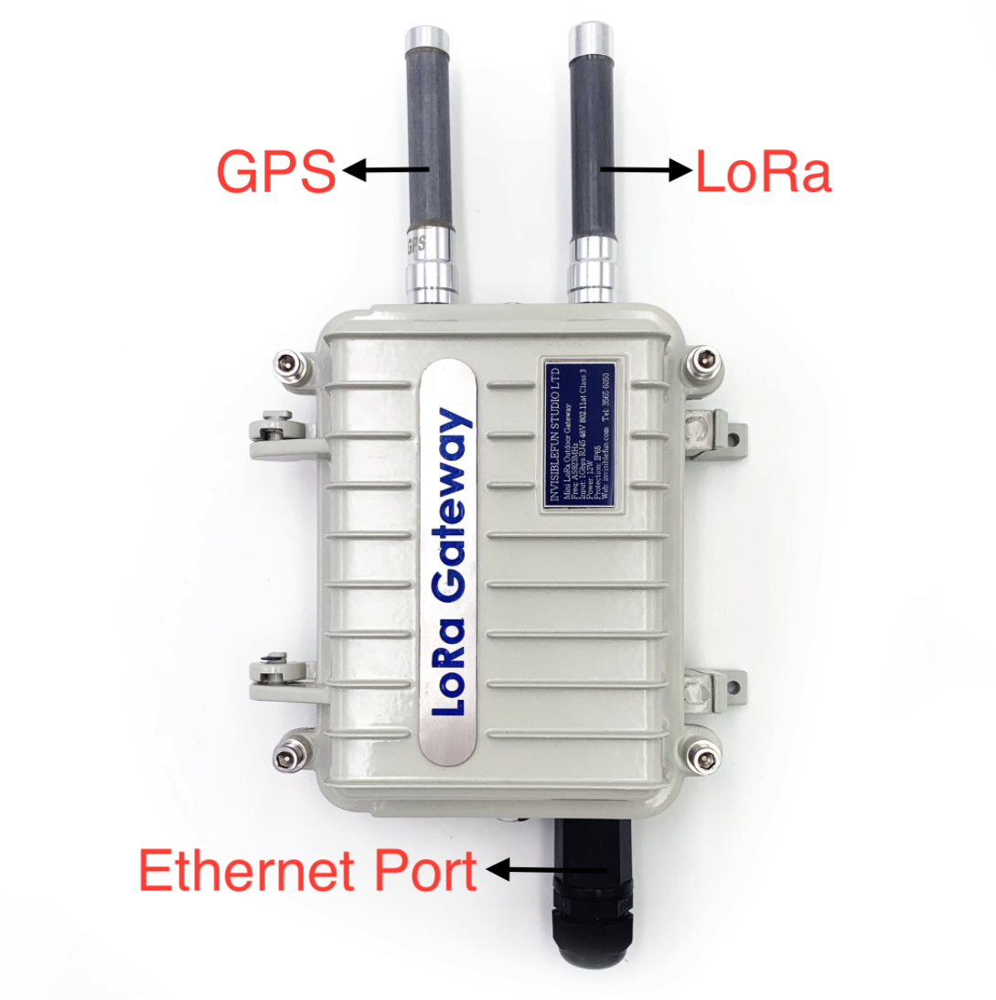
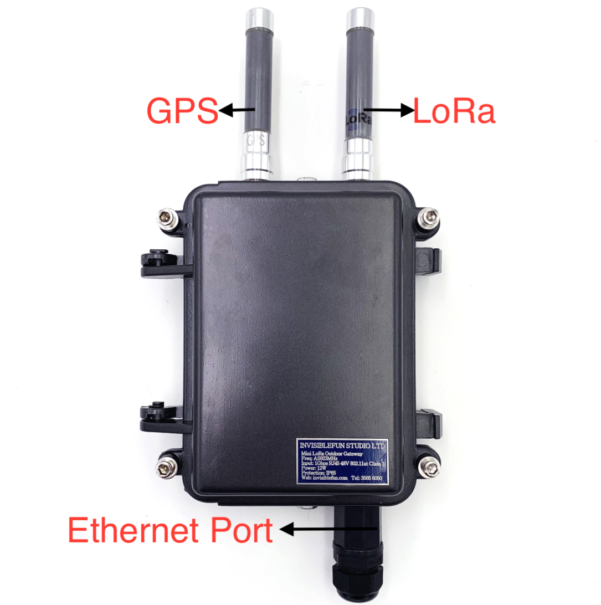

# Gateway Manual

## Installing the Device

Use POE RJ45 cable to connect with the Gateway

## DHCP

DHCP client is enabled by default. If no DHCP server in the local network, the gatway falls back to IP of 192.168.1.23/24.

## Login in GUI

Go to the GUI of the Gateway

The GUI hosts on 80 port

  `https://thegatewayip`

import {Printbreak} from './printbreak'

<Printbreak/>

## Login Page

Login With:

  - Username: admin

  - Password: admin

<Printbreak/>

## Update Radio Setting in GUI

Packet Forwarder Setting :

 - Setting Server Address as Destination Address 
 - Setting Server Port
 - The Gateway will forward the data to the server address with specify port.

<Printbreak/>

Input the IP address of the server which need to handle LoRa data

For example:

Input the port number of the server to commumicate

For example:

The gateway has 8 channels. The Radio 0 and 1 is the central frequency. The frequency of each channels needs to specify positive and negative adjustment depending on the frequency of the radio.

After Setting channels,press 'Save' button to apply.

<Printbreak/>

## LoRa Outdoor Gateway Specification

import {DenseTable} from './specification'

<DenseTable />

<Printbreak/>

<Printbreak/>

<Printbreak/>

## Regulatory Information

### EMC, Safety, and R&TTE Directive (RED) Compliance

The CE mark is affixed to this product to confirm compliance with the following European Community Directives:

    Council Directive 2011/65/EU on the restriction of the use of certain hazardous substances in electrical
    and electronic equipment;

    and

    Council Directive 2014/53/EU on radio equipment and telecommunications terminal equipment and the
    mutual recognition of their conformity.

    and

    Council Directive 2014/35/EU on the harmonization of the laws of Member States relating to Electrical
    Equipment designed for use within certain voltage limits.

<Printbreak/>

## Installation Safety
This information is also available in the Installation Guide.

  Warnings and Cautions
    Warning and Caution symbols mean potential danger. You are in a situation that could cause bodily injury. Before
    working on any equipment, be aware of hazards in the installation area and be knowledgeable about electrical
    circuitry. Be familiar with standard practices for preventing accidents.

  For translations of key cautions and warnings, refer Appendix A.

Warning: Only trained and qualified personnel should install, replace, or service this equipment. Installation
must comply with local and national electrical codes.

      When installing or replacing the unit, the ground connection must always be made first and disconnected last.

       - Disconnect POE power (Ethernet POE port) before servicing IP67 Base Station.

       - Do not work on the system or connect or disconnect cables during periods of lightning activity.

       - This device is not designed or approved to be used in any Hazardous Locations. 
         Do not install or operate device if area is known to be an explosive environment.

       - Externally ground this equipment using a customer-supplied ground wire before applying power.

       - Contact an electrician if you are uncertain that suitable grounding is available. 
         Refer to Installing the Ground Wire instructions. 
         < All wall mounting installations are subject to the acceptance of local jurisdiction.

       - Do not locate antenna near overhead power lines or other electric light or power circuits, 
         or where it can come into contact with such circuits. 
         When installing the antenna, take extreme care not to come into contact with such circuits, 
         because they may cause serious injury or death. 
         For proper installation and grounding of the antenna, 
         please refer to national and local codes.

Warning:

  HOT SURFACE DO NOT TOUCH

  Note: This symbol is included on the serial label. UL evaluated this device to a safety and outdoor certification temperature of -30c to +70c.

### Lithium Battery

  - A lithium battery (3V, coin cell, CR1632) located within the product provides backup power for the timekeeping. This battery has an estimated life expectancy of ten years.
    
  - When this battery starts to weaken, the date and time may be incorrect.
  
  - Battery is not user replaceable. If the battery fails, the device must be sent back to Invisible fun studio ltd Systems for battery replacement.
    
  - Lithium cells and batteries are subject to the Provisions for International Transportation. Invisible fun studio ltd confirms that the Lithium batteries used in the Invisible fun studio ltd product(s) referenced in this manual comply with Special Provision 188 of the UN Model Regulations, Special Provision A45 of the ICAO-TI/IATADGR (Air),  Special Provision 310 of the IMDG Code, and Special Provision 188 of the ADR and RID (Road and Rail Europe).

  
  CAUTION: Risk of explosion if this battery is replaced by an incorrect type. Dispose of batteries according to
  instructions.
  
  Attention: Risque d'explosion si vous remplacez la batterie par un modèle incompatible. Jetez les piles usagées
  selon les instructions.

## User Responsibility
  Respect all local regulations for operating your wireless device. Use the security features to block unauthorized use and theft.

<Printbreak/>

## Device Maintenance

  Do not attempt to disassemble the device. There are no user serviceable parts inside.
  When maintaining your device:

  - Do not misuse the device. Follow instructions on proper operation and only use as intended. Misuse could make the device inoperable, damage the device and/or other equipment, or harm users

  - Do not apply excessive pressure or place unnecessary weight on the device. This could result in damage to the device or harm to users.

  - Do not use this device in explosive or hazardous environments unless the model is specifically approved for such use. The device may cause sparks. Sparks in explosive areas could cause explosion or fire and may result in property damage, severe injury, and/or death.

  - Do not expose your device to any extreme environment where the temperature or humidity is high. Such exposure could result in damage to the device or fire. Refer to the device specifications regarding recommended operating temperature and humidity.

  - Do not place the device alongside computer discs, credit or travel cards, or other magnetic media. The information contained on discs or cards may be affected by the device.

  - Using accessories, such as antennas, that Invisible fun studio ltd has not authorized or that are not compliant with Invisible fun studio ltd's accessory specifications may invalidate the warranty.

Notice regarding Compliance with FCC, EU, and Industry Canada Requirements for RF Exposure

  The antenna intended for use with this unit meets the requirements for mobile operating configurations and for
  fixed mounted operations, as defined in 2.1091 of the FCC rules for satisfying RF exposure compliance. This device
  also meets the European RF exposure requirements of EN 62311. If an alternate antenna is used, consult user
  documentation for required antenna specifications.

  Compliance of the device with the FCC, EU and IC rules regarding RF Exposure was established and is given with
  the maximum antenna gain as specified above for a minimum distance of 35 cm between the devices radiating
  structures (the antenna) and the body of users. Qualification for distances closer than 35 cm (portable operation)
  would require re-certification.

  Wireless devices could generate radiation. Other nearby electronic devices, like microwave ovens, may also
  generate additional radiation to the user causing a higher level of RF exposure.

## Radio Frequency (RF) Safety

Due to the possibility of radio frequency (RF) interference, it is important that you follow any special regulations
regarding the use of radio equipment. Follow the safety advice given below.

  - Operating your device close to other electronic equipment may cause interference if the equipment is inadequately protected. Observe any warning signs and manufacturers’ recommendations.

  - Different industries and businesses restrict the use of cellular devices. Respect restrictions on the use of radio equipment in fuel depots, chemical plants, or where blasting operations are in process. Follow restrictions for any environment where you operate the device.
  
  - Do not place the antenna outdoors.

  - Switch OFF your wireless device when in an aircraft. Using portable electronic devices in an aircraft may endanger aircraft operation, disrupt the cellular network, and is illegal. Failing to observe this restriction may lead to suspension or denial of cellular services to the offender, legal action, or both.

  - Switch OFF your wireless device when around gasoline or diesel-fuel pumps and before filling your vehiclewith fuel.
  
  - Switch OFF your wireless device in hospitals and any other place where medical equipment may be in use.

<Printbreak/>

## Interference with Pacemakers and Other Medical Devices

 Potential interference

  Radio frequency energy (RF) from cellular devices can interact with some electronic devices. This is
  electromagnetic interference (EMI). The FDA helped develop a detailed test method to measure EMI of implanted
  cardiac pacemakers and defibrillators from cellular devices. This test method is part of the Association for the
  Advancement of Medical Instrumentation (AAMI) standard. This standard allows manufacturers to ensure that
  cardiac pacemakers and defibrillators are safe from cellular device EMI.

  The FDA continues to monitor cellular devices for interactions with other medical devices. If harmful interference
  occurs, the FDA will assess the interference and work to resolve the problem.

## Precautions for pacemaker wearers

If EMI occurs, it could affect a pacemaker in one of three ways:

  - Stop the pacemaker from delivering the stimulating pulses that regulate the heart's rhythm.

  - Cause the pacemaker to deliver the pulses irregularly.

  - Cause the pacemaker to ignore the heart's own rhythm and deliver pulses at a fixed rate.

Based on current research, cellular devices do not pose a significant health problem for most pacemaker wearers.
However, people with pacemakers may want to take simple precautions to be sure that their device doesn't cause
a problem.
  
  Keep the device on the opposite side of the body from the pacemaker to add extra distance between the
  pacemaker and the device.

  Avoid placing a turned-on device next to the pacemaker (for example, don’t carry the device in a shirt or
  jacket pocket directly over the pacemaker).

<Printbreak/>

## Waste Electrical and Electronic Equipment Statement

  Note: This statement may be used in documentation for your final product applications.

### WEEE Directive

  The WEEE Directive places an obligation on EU-based manufacturers, distributors, retailers, and importers to takeback electronics products at the end of their useful life. A sister directive, ROHS (Restriction of Hazardous
  Substances) complements the WEEE Directive by banning the presence of specific hazardous substances in the
  products at the design phase. The WEEE Directive covers all Invisible fun studio ltd products imported into the EU as of August
  13, 2005. EU-based manufacturers, distributors, retailers and importers are obliged to finance the costs of recovery
  from municipal collection points, reuse, and recycling of specified percentages per the WEEE requirements.

### Instructions for Disposal of WEEE by Users in the European Union

  The symbol shown below is on the product or on its packaging, which indicates that this product must not be
  disposed of with other waste. Instead, it is the user's responsibility to dispose of their waste equipment by handing
  it over to a designated collection point for the recycling of waste electrical and electronic equipment. The separate
  collection and recycling of your waste equipment at the time of disposal will help to conserve natural resources
  and ensure that it is recycled in a manner that protects human health and the environment. For more information
  about where you can drop off your waste equipment for recycling, please contact your local city office, your
  household waste disposal service or where you purchased the product.

## Restriction of the Use of Hazardous Substances (RoHS)

Invisible fun studio ltd

Certificate of Compliance

2015/863

Invisible fun studio ltd confirms that its embedded products comply with the chemical concentration limitations
set forth in the directive 2015/863 of the European Parliament (Restriction of the use of certain Hazardous
Substances in electrical and electronic equipment - RoHS).

<Printbreak/>

These Invisible fun studio ltd products do not contain the following banned chemicals:

  - Lead, [Pb] < 1000 PPM
  - Mercury, [Hg] < 100 PPM
  - Cadmium, [Cd] < 100 PPM
  - Hexavalent Chromium, [Cr+6] < 1000 PPM
  - Polybrominated Biphenyl, [PBB] < 1000 PPM
  - ENVIRONMENTAL NOTICES
  - 34 Conduit® Base Station IP67 Getting Started Guide for Versions 1.5 and 2.1
  - Polybrominated Diphenyl Ethers, [PBDE] < 1000 PPM
  - Bis(2-Ethylhexyl) phthalate (DEHP): < 1000 ppm
  - Benzyl butyl phthalate (BBP): < 1000 ppm
  - Dibutyl phthalate (DBP): < 1000 ppm
  - Diisobutyl phthalate (DIBP): < 1000 ppm
  - Environmental considerations:
  - Moisture Sensitivity Level (MSL) =1
  - Maximum Soldering temperature = 260C (in SMT reflow oven)

Lead usage in some components is exempted by the following RoHS annex, therefore higher lead concentration
would be found in some modules (>1000 PPM);

Resistors containing lead in a glass or ceramic matrix compound.

## REACH Statement

Registration of Substances

Invisible fun studio ltd confirms that none of its products or packaging contain any of the Substances of Very
High Concern (SVHC) on the REACH Candidate List, in a concentration above the 0.1% by weight allowable limit